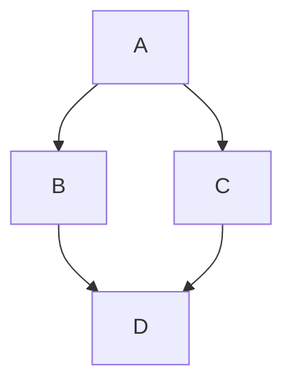

- [1. 概述](#1-概述)
- [2. 基础语法](#2-基础语法)
  - [2.1 标题](#21-标题)　[2.2 段落与换行](#22-段落与换行)　[2.3 文本样式](#23-文本样式)　[2.4 列表](#24-列表)　[2.5 链接](#25-链接)　[2.6 图片](#26-图片)　[2.7 引用块](#27-引用块)　[2.8 代码](#28-代码)　[2.9 水平线](#29-水平线)　[2.10 转义字符](#210-转义字符)
- [3. 扩展语法](#3-扩展语法)
  - [3.1 任务列表](#31-任务列表)　[3.2 表格](#32-表格)　[3.3 脚注](#33-脚注)　[3.4 删除线](#34-删除线)　[3.5 Emoji](#35-emoji)　[3.6 高亮文本](#36-高亮文本)　[3.7 上标与下标](#37-上标与下标)
- [4. 高级技巧](#4-高级技巧)
  - [4.1 行内 HTML](#41-行内-html)　[4.2 Markdown 注释](#42-markdown-注释)　[4.3 数学公式 (LaTeX)](#43-数学公式latex)　[4.4 图表与流程图 (Mermaid)](#44-图表与流程图mermaid)
- [5. 最佳实践](#5-最佳实践)
- [📋 版本历史](#-版本历史)

---

## 1. 概述

Markdown 是一种轻量级标记语言，使用易读易写的纯文本格式编写文档，可转换为 HTML。本手册涵盖标准语法、GitHub Flavored Markdown (GFM) 及常用扩展。

---

## 2. 基础语法

### 2.1 标题

使用 `#` 表示标题，共六级，`#` 后需加空格。

**语法：**

```markdown
# 一级标题
## 二级标题
### 三级标题
#### 四级标题
##### 五级标题
###### 六级标题
```

### 2.2 段落与换行

- **段落**：用空行分隔
- **换行**：行末加两个空格后换行，或用 `<br>`

```markdown
段落一。（末尾无空格）

第一行末尾两个空格··
第二行（此为同一段落，产生换行）
```

### 2.3 文本样式

| 样式 | 语法 | 效果 |
| :--- | :--- | :--- |
| 粗体 | `**粗体**` | **粗体** |
| 斜体 | `*斜体*` | *斜体* |
| 粗斜体 | `***粗斜体***` | ***粗斜体*** |
| 删除线 | `~~删除线~~` | ~~删除线~~ |
| 行内代码 | `` `code` `` | `code` |
| 下划线 | `<u>下划线</u>` | <u>下划线</u> |

### 2.4 列表

**无序列表**：使用 `-`、`+` 或 `*`

```markdown
- 苹果
- 香蕉
  - 子项（缩进 2 或 4 空格）
```

**有序列表**：数字加句点，序号自动修正

```markdown
1. 第一步
2. 第二步
   1. 子步骤 A
3. 第三步
```

> 列表可任意嵌套混合。

### 2.5 链接

**行内链接**：`[文字](URL "可选标题")`

```markdown
[Markdown 官方](https://www.markdownguide.org)
```

**引用式链接**（适合复用）：

```markdown
[Google][1] 和 [GitHub][2]

[1]: https://www.google.com
[2]: https://github.com
```

**自动链接**：`<https://example.com>` → <https://example.com>

### 2.6 图片

语法与链接类似，前面加 `!`：``

```markdown

```

也支持引用式：

```markdown
![Logo][logo]
[logo]: https://example.com/logo.png
```

### 2.7 引用块

使用 `>`，可嵌套，内部可包含其他 Markdown 元素。

```markdown
> 一级引用
>
> > 嵌套引用
>
> 回到一级
```

### 2.8 代码

**行内代码**：用单个反引号包裹 `` `printf("hello");` ``

**代码块**：使用三个反引号并指定语言以启用语法高亮。

````markdown
```c
#include <stdio.h>

int main() {
    printf("Hello, Markdown!\n");
    return 0;
}
```
````

### 2.9 水平线

三个或更多 `-`、`*` 或 `_` 单独成行：

```markdown
---
***
___
```

### 2.10 转义字符

用 `\` 转义特殊字符以显示原样：`\* 不是斜体 \*`、`\# 不是标题`

可转义字符：`` \ ` * _ { } [ ] ( ) # + - . ! | ``

---

## 3. 扩展语法

### 3.1 任务列表

```markdown
- [x] 已完成
- [ ] 待办
- [ ] 子任务
  - [x] 子项 A
```

### 3.2 表格

冒号控制对齐：左 `:---` / 中 `:---:` / 右 `---:`

```markdown
| 左对齐 | 居中 | 右对齐 |
| :--- | :---: | ---: |
| 苹果 | 红色 | 5.00 |
| 香蕉 | 黄色 | 3.50 |
```

### 3.3 脚注

```markdown
带脚注的句子[^1]。

[^1]: 脚注具体内容。
```

### 3.4 删除线

`~~即将删除的内容~~` → ~~即将删除的内容~~

### 3.5 Emoji

短码或直接输入：`:smile:` → :smile:　`:rocket:` → :rocket:　😃

> 常用短码参考：[Emoji Cheat Sheet](https://github.com/ikatyang/emoji-cheat-sheet)

### 3.6 高亮文本

**HTML 方式（通用）**：`<mark>高亮文字</mark>` → <mark>高亮文字</mark>

**扩展语法（Typora 等）**：`==高亮文字==` → ==高亮文字==

### 3.7 上标与下标

**HTML 方式**：`H<sub>2</sub>O`、`E = mc<sup>2</sup>`

**扩展语法（Typora 等）**：`H~2~O`、`E = mc^2^`

---

## 4. 高级技巧

### 4.1 行内 HTML

Markdown 允许直接嵌入 HTML，适合复杂布局。

```html
<div style="color: blue;">蓝色文字</div>
<span style="background: yellow;">高亮背景</span>
```

> 注意：部分平台可能过滤 HTML 标签。

### 4.2 Markdown 注释

使用 HTML 注释语法（不会在渲染后显示）：

```html
<!-- 这是注释，不会显示 -->
```

### 4.3 数学公式 (LaTeX)

需 MathJax / KaTeX 渲染引擎支持。

**行内**：`$E = mc^2$` → $E = mc^2$

**块级**：

```latex
$$
\int_{a}^{b} f(x) \, dx
$$
```

### 4.4 图表与流程图 (Mermaid)

支持 Mermaid 的平台（GitHub、Typora）可绘制流程图：

````markdown

````

---

## 5. 最佳实践

1. **统一语法风格** — 全篇用一致的标记方式（如统一 `-` 而非混用 `*`）
2. **代码块指定语言** — 启用语法高亮，提高可读性
3. **空行分隔段落** — 适当留白让源文件也更易读
4. **标题层级不跳级** — 从 `##` 开始（`#` 通常留给页面标题）
5. **链接用引用式** — 多处使用同一链接时，引用式更便于维护
6. **图片加替代文本** — 提升可访问性，加载失败时也有提示
7. **表格对齐明确** — 显式指定对齐方式，不依赖默认
8. **避免裸 URL** — 用 `<>` 包裹或写完整链接语法，明确意图
9. **善用 HTML 注释** — 给自己或合作者留备忘，不影响渲染
10. **保持简洁** — Markdown 的精髓是"易读"，不要过度嵌套

---
